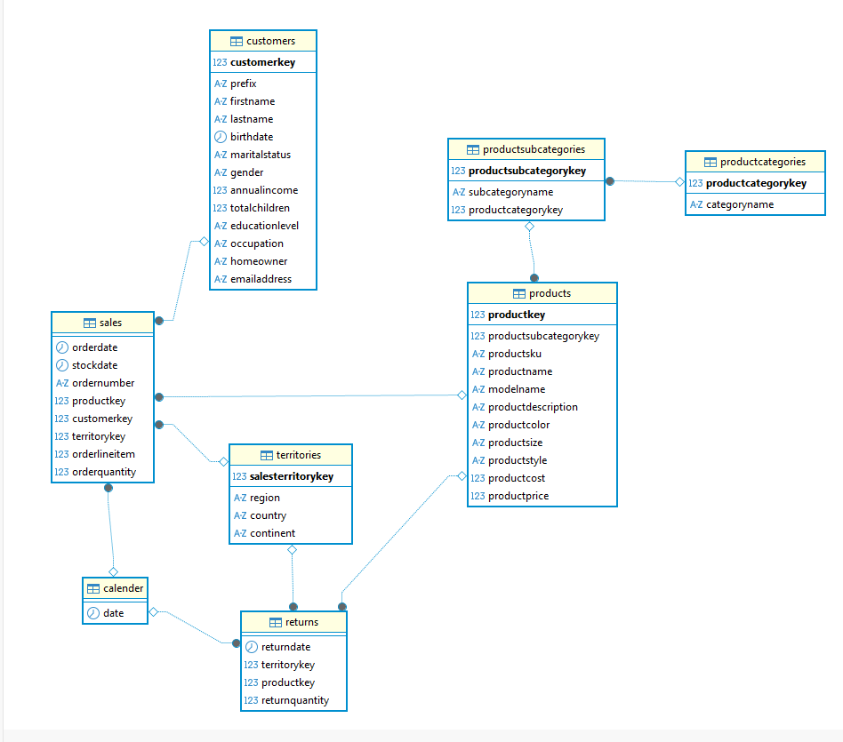
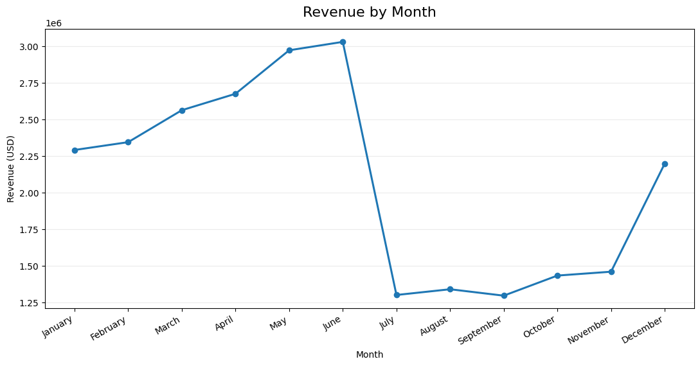
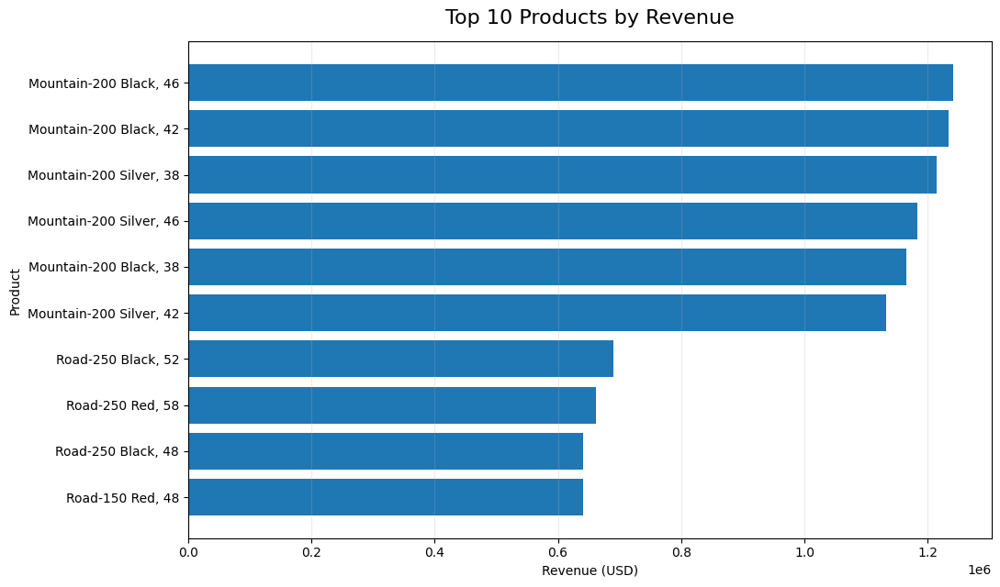
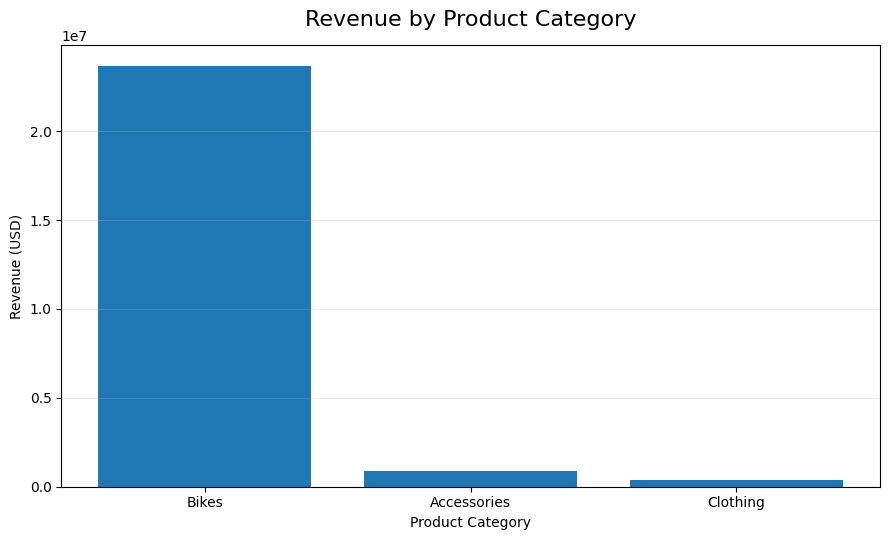
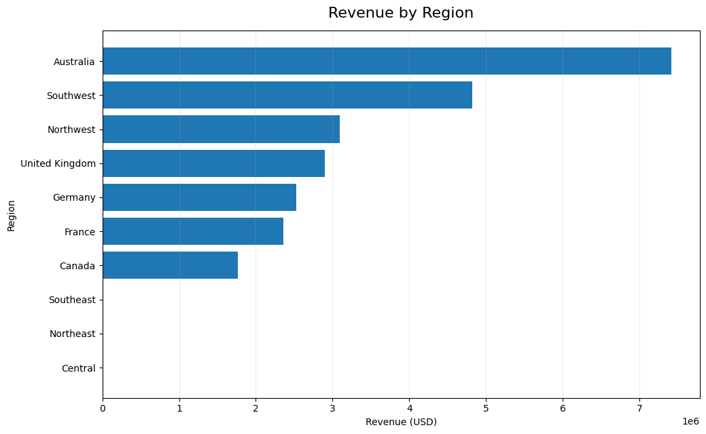
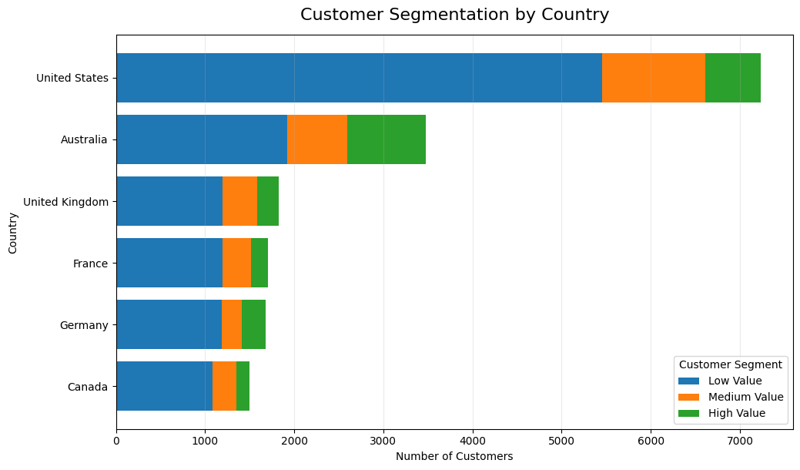

# AdventureWorks Sales & Business Analytics using SQL

## Project Overview

This project uses SQL to analyze the AdventureWorks retail dataset and answer key business questions related to sales performance, products, customers, orders, and geographic performance.

The objective was to move beyond basic SQL queries and use relational data to generate business insights that could support sales and customer-focused decision making.

### Core Business Questions

- How does revenue change over time?
- Which products and product categories drive the most revenue?
- Which regions contribute the most to revenue?
- How concentrated is revenue among individual customers?
- How are customers distributed across value segments?
- Which areas of the business require further investigation?

---

## Dataset

The project uses the AdventureWorks sample dataset obtained from Kaggle.

The dataset contains relational data covering:

- Sales transactions
- Customers
- Products
- Product categories
- Product sub-categories
- Territories
- Calendar information
- Returns

The raw CSV files used for the analysis are included in the `dataset/` directory.

> **Dataset Source:** Kaggle  
> **Note:** The dataset is used for educational and portfolio analysis purposes.

---

## Database Schema

The dataset follows a relational structure in which sales transactions connect customers, products, territories, and calendar information.

The main product hierarchy is:

**Product Category → Product Sub-category → Product → Sales**

Other important relationships include:

**Customer → Sales**

**Territory → Sales**

**Calendar → Sales**

**Product → Returns**



---

# SQL Analysis

## 1. Revenue Analysis

Revenue was analyzed by month to identify changes in sales activity throughout the year.



### Key Finding

Revenue shows a clear monthly pattern, with revenue reaching its highest levels in May and June before declining sharply from July through September and recovering in December.

June generated approximately **$3.03M** in revenue, while September generated approximately **$1.30M**.

The dataset also shows a significant decline in order volume between June and July. Further investigation would be required to determine whether this reflects seasonality, data coverage, operational factors, or another business cause.

---

## 2. Top Products by Revenue

The top revenue-generating products were identified using product-level aggregation and ranking.



### Key Finding

**6 of the top 10 revenue-generating products are Mountain-200 variants**, showing the strong contribution of this product line to overall revenue.

The Mountain-200 Black, 46 product generated the highest revenue among the products analyzed, at approximately **$1.24M**.

---

## 3. Revenue by Product Category

Revenue was aggregated at the product-category level.



### Key Finding

The business is highly concentrated around the **Bikes** category.

- Bikes: approximately **$23.64M**
- Accessories: approximately **$0.91M**
- Clothing: approximately **$0.37M**

Bikes account for approximately **95% of total revenue** in the dataset.

Further sub-category analysis showed that **Road Bikes, Mountain Bikes, and Touring Bikes together account for approximately 95% of total revenue**, with Road Bikes alone contributing roughly 48%.

---

## 4. Revenue by Region

Revenue was analyzed across geographic regions to identify the largest contributors.



### Key Finding

**Australia** was the largest revenue-contributing region, generating approximately **$7.42M**.

Other major contributors included:

- Southwest — approximately $4.82M
- Northwest — approximately $3.10M
- United Kingdom — approximately $2.90M
- Germany — approximately $2.52M
- France — approximately $2.36M
- Canada — approximately $1.77M

A small number of regions contributed comparatively little revenue in the available dataset. These differences should be interpreted alongside transaction and customer volumes before concluding that a region is underperforming.

---

## 5. Customer Segmentation

Customers were segmented into Low Value, Medium Value, and High Value groups based on their revenue contribution.

The segmentation was analyzed across countries.



### Key Finding

The United States has the largest customer base in the dataset, with a substantial proportion classified as Low Value.

Australia has the second-largest customer base and also contains a comparatively large High Value customer segment.

This segmentation can help businesses identify markets with a stronger concentration of high-value customers and areas where customer value could potentially be increased.

---

# Additional Business Findings

### Revenue Concentration by Product

Revenue is highly concentrated in the Bikes category and, within Bikes, primarily in Road Bikes, Mountain Bikes, and Touring Bikes.

This indicates that a relatively small number of core product lines are responsible for most of the revenue.

### Customer Revenue Concentration

The top 20 individual customers generated approximately **$210.6K**, representing less than **1% of total revenue**.

This suggests that overall revenue is broadly distributed across the customer base rather than being heavily dependent on a small number of individual customers.

### Order Volume Pattern

June recorded the highest monthly order volume at approximately **5,954 orders**.

Order volume then dropped sharply to approximately **1,634 orders in July**, representing a decline of more than 70%.

Because the dataset does not explain the reason for this change, further investigation would be required before attributing it to seasonality or operational issues.

---

# SQL Techniques Demonstrated

The project demonstrates practical SQL techniques including:

- SELECT and filtering
- Aggregate functions
- GROUP BY
- ORDER BY
- HAVING
- INNER JOIN
- Multiple-table joins
- CASE statements
- Common Table Expressions (CTEs)
- Date-based analysis
- Customer segmentation
- Ranking and Top-N analysis
- Revenue aggregation
- Geographic analysis
- Relational data analysis

---

# Business Recommendations

Based on the analysis:

1. **Monitor the Bikes category closely**, as it contributes the overwhelming majority of revenue.
2. **Evaluate Road Bike and Mountain Bike performance**, given their significant contribution to total revenue.
3. **Investigate the sharp July decline** in both orders and revenue to determine whether it is caused by seasonality, data coverage, operational issues, or another factor.
4. **Identify opportunities to increase customer value**, particularly in markets with large Low Value customer segments.
5. **Continue monitoring geographic performance**, especially major revenue-contributing regions such as Australia and the Southwest.
6. Consider expanding the analysis into profitability, margins, and return behavior if cost and profit data becomes available.

---

# Tools Used

- PostgreSQL
- DBeaver
- SQL
- CSV
- Data Analysis
- Data Visualization

# Conclusion

This project demonstrates how SQL can be used to transform relational
business data into actionable insights.

Rather than focusing only on individual SQL queries, the analysis follows
a business-oriented approach covering revenue trends, product performance,
category concentration, geographic performance, and customer segmentation.

The analysis highlights strong dependence on the Bikes category,
significant contributions from a small number of product lines,
geographic differences in revenue, and a notable mid-year decline
in order activity that warrants further investigation.

# Project Structure

```text
adventureworks-sql-business-analytics/
│
├── README.md
│
├── dataset/
│   ├── AdventureWorks_Calendar.csv
│   ├── AdventureWorks_Customers.csv
│   ├── AdventureWorks_Product_Categories.csv
│   ├── AdventureWorks_Product_Subcategories.csv
│   ├── AdventureWorks_Products.csv
│   ├── AdventureWorks_Returns.csv
│   ├── AdventureWorks_Sales.csv
│   └── AdventureWorks_Territories.csv
│
├── sql/
│   ├── sales_analysis.sql
│   ├── customer_analysis.sql
│   ├── product_analysis.sql
│   ├── order_analysis.sql
│   └── territory_analysis.sql
│
└── images/
    ├── adventureworks_erd.png
    ├── monthly_sales_trend.png
    ├── top_10_products.png
    ├── revenue_by_producct_category.png
    ├── revenue_by_region.png
    └── customer_segmentation_by_country.png
